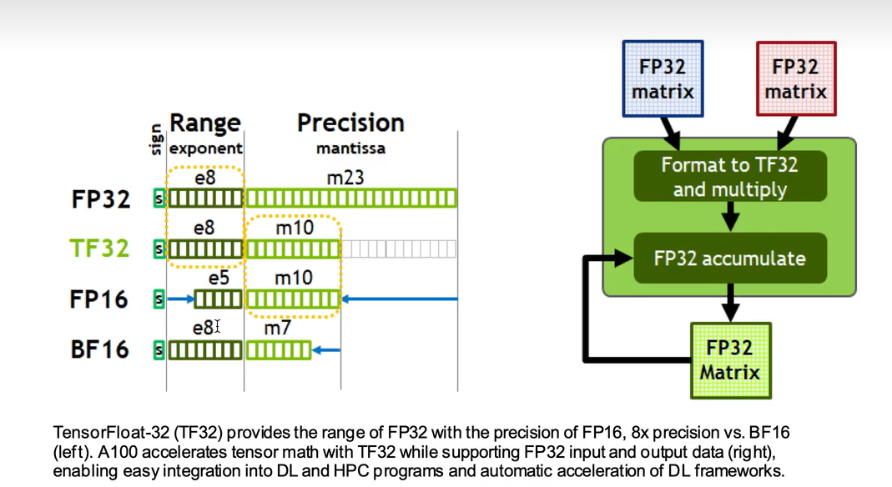

从0开始构建gpt2,按视频教程一步步进行

### 25-11-18
[play.ipynb](play.ipynb)加载来自transformers的gpt2模型,并根据官方demo输出流模型的参数,实现了利用模型进行输出

25-11-19: 实现了dataloader,模型预测和训练,并得知为什么要在残差中乘上 (n**-0.5) :见play中的实验
```python
import torch
x=torch.zeros(768)
n=100
for i in range(n):
    x+=torch.randn(768)
# 由于残差的影响,多次残差后标准差会发生偏移,nearly sqrt(n)
print(x.std ())
# 通过对x缩放来使得标准差与n的平方根相同
print(x.std()/n**0.5)

x=torch.zeros(768)
n=100
for i in range(n):
    x+=torch.randn(768)*n**-0.5
print(x.std())
```
使得方差缩放回1左右

### 11-20:  计算与精度

`torch.set_float32_matmul_precision('high')`可以用于设置运算精度,在带来微量误差的同时,提升运算速度,但很多时候仍受到内存(显存)速率影响

tf32和fp16具有相同的尾数长度,仅阶码部分存在差异,
tf32和bf16具有相同的阶码长度,仅尾数长度不同,更适合fp32和tf32截断尾数进行运算,从而提升运算效率



`torch.amp.autocast` 是 PyTorch 提供的一个工具，用于自动处理混合精度训练中的[数值类型](https://so.csdn.net/so/search?q=数值类型&spm=1001.2101.3001.7020)选择，使得计算能在尽量减少精度损失的同时，提升性能。

1. 当代码进入 `autocast` 上下文时，PyTorch 会自动将相关操作（如矩阵乘法、卷积等）切换到 **低精度浮点数**（通常为 `float16` 或 `bfloat16`），以提高计算速度和节省显存。
2. 计算完成后，`autocast` 会退出上下文并将所有变量恢复到 **默认精度**（通常是 `float32`）。这对于梯度计算和权重更新至关重要，因为在低精度下进行梯度计算可能会导致数值不稳定或精度损失。
3. 在 `autocast` 内部进行的前向传播计算使用低精度（`float16` 或 `bfloat16`），但 **梯度计算和权重更新** 操作仍然在 **`float32`** 精度下进行，以保证数值稳定性。

```python
# Creates model and optimizer in default precision
model = Net().cuda()
optimizer = optim.SGD(model.parameters(), ...)

# Creates a GradScaler once at the beginning of training.
scaler = GradScaler()

for epoch in epochs:
    for input, target in data:
        optimizer.zero_grad()

        # Runs the forward pass with autocasting.
        with autocast(device_type='cuda', dtype=torch.float16):
            output = model(input)
            loss = loss_fn(output, target)

        # Scales loss.  Calls backward() on scaled loss to create scaled gradients.
        # Backward passes under autocast are not recommended.
        # Backward ops run in the same dtype autocast chose for corresponding forward ops.
        scaler.scale(loss).backward()

        # scaler.step() first unscales the gradients of the optimizer's assigned params.
        # If these gradients do not contain infs or NaNs, optimizer.step() is then called,
        # otherwise, optimizer.step() is skipped.混合精度专用,用于避免上下溢
        scaler.step(optimizer)

        # Updates the scale for next iteration.
        scaler.update()
```

amp中会使用fp16/32的模块见[链接](https://docs.pytorch.org/docs/stable/amp.html#cuda-ops-that-can-autocast-to-float16)
一般而言,**乘法不易受精度影响**,而指数运算影响较大,具体看链接吧

`import code;code.interact(local=locals())`使用这段代码可以截断运行并保存运行状态,然后打开一个ipython**解释器**，让你可以实时查看和操作当前作用域内的变量与函数。

## torch.compile

 torch.compile 通过 JIT 将 PyTorch 代码编译成优化的内核，使 PyTorch 代码运行得更快

win中使用triton不能直接pip,使用hf编译好的[链接](https://hf-mirror.com/madbuda/triton-windows-builds),本地pip安装即可

`torch.compile(model)`就是最简单的实现,后续有更复杂的需求再实现


## FlashAttention

1. 标准注意力机制的核心瓶颈是 **“中间状态存储”**：计算 Softmax (QKᵀ)・V 时，会先显式计算并存储巨大的 QKᵀ 矩阵,
2. FlashAttention 的核心突破是 **“分块计算（Tiling）”** 和 **“计算与访存的重叠（Fusion）”**，具体逻辑如下：
   1. **分块处理 Q、K、V**：将 Q、K、V 按序列长度维度拆分为多个小块（例如每个块的大小为 [B, H, T, C]，其中 T 是块的序列长度，远小于总序列长度 L）；
   2. **块内即时计算**：对每个小块，仅加载当前块的 Q、K 进行 QKᵀ 计算，随后**立即与块内的 V 进行矩阵乘法**，并将结果累加至最终输出，避免存储完整的 QKᵀ 矩阵；
   3. **Softmax 分块融合**：QKᵀ 计算后，先在块内计算 Softmax 的中间结果（最大值、求和项），再与下一块的结果合并，最终得到全局 Softmax 结果，同样**无需存储完整的 Softmax 矩阵**。
   4. FlashAttention 将内存占用从 **O(L²)** 降低至 **O(L√L)**

3. FlashAttention 深度**适配了 GPU 的多级存储架构**（寄存器 → 共享内存 → 显存 → 内存），通过 “数据本地化” 减少跨层级访存的延迟：
   1. **优先使用高速存储**：将小块 Q、K、V 加载到 GPU 的共享内存（Shared Memory，带宽远高于显存）中进行计算，避免频繁从显存读取数据；
   2. **寄存器级计算融合**：在 GPU **核心的寄存器中直接完成 QKᵀ、Softmax、V 乘法的部分计算，减少数据在寄存器与共享内存之间的搬运**；
   3. **避免冗余访存**：通过 “计算 - 存储重叠”，在加载下一块数据的同时，对当前块进行计算，隐藏访存延迟。

compare:

without flashAttention:8850 t/s
with flashAttention :15000 t/s

提升了约60%的运算效率

#### 使用更多2的指数次幂来提升运算速度

vocab_size=50304 17425.3token/s
vocab_size= 50257 15005.4token/s
提升了约16%

二进制转换 50257->1100010001010001,通过抹掉后面的0来进位,即50304->1100010010000000即所求

weakness:

1. embedding bring more GPU memory use
2. some of token probility have to be drop

### 手动操作optimizer

通过Vit中的configure_optimizer方法,实现对不同layer使用不同的optimize,具体操作看git过程和注释

### 梯度累计gradient accumulate

帮助你在low GRAM也能follow large batch_size

方法:在train 循环中添加loss的累积循环直至累计batch=目标batch
要求:loss默认使用mean方法,因此loss的每一次backwards前都要/grad_accum_steps

## DistributeDataParallel 多显卡计算(数据并行)

1. set GPU RANK (on ddp part)
2. set batchsize `grad_accum_steps = total_batch_size // (B * T * ddp_world_size)` every batch become multy gpu process,
3. if ddp:    destroy_process_group() 训练完成后要销毁
4. dataloader:    make each process have different data
5. `model = DDP(model, device_ids=[ddp_local_rank])`#把模型包成 DDP，让它在多进程多卡下自动做梯度同步。
6. backward:			

让程序只看到 2、3 两张实际显卡
`CUDA_VISIBLE_DEVICES=2,3 python train.py`
在程序中：
  "cuda:0" 实际是物理卡 2
  "cuda:1" 实际是物理卡 3

## dataset

fineWeb-edu-sample-10BT ,using [fineweb.py](fineweb.py)  to download  or download on hugging face

遇到443网络问题:

1. 手动下载数据集到本地(下载失败也会创建目录结构)
2. 手动调整文件读取路径`fw = load_dataset("./edu_fineweb10B", split="train") `

多线程问题:windows下记得把多线程部分放在`if __name__ == "__main__":`内,否则会有调用异常,产生循环调用

##### loss

step  111 | loss: 7.572558 | lr 9.3986e-05 | norm: 91179.6406 | dt: 50265.78ms | tok/sec: 20860.63
step  112 | loss: 7.528384 | lr 9.4825e-05 | norm: 90551.3672 | dt: 50270.84ms | tok/sec: 20858.53
step  113 | loss: 7.484374 | lr 9.5664e-05 | norm: 90010.0078 | dt: 50610.49ms | tok/sec: 20718.55
step  114 | loss: 7.440380 | lr 9.6503e-05 | norm: 89621.7109 | dt: 50634.60ms | tok/sec: 20708.69

性能问题,5000step跑不完,就到此为止了

11-23

增加了val部分的代码,包括val_loss & val model output

### val data2  HellaSwag 


using batch_size=4的input,lenth为最长的input,其余做padding.其他模型可能可以context+option 一次性输入,但是gpt2因为size问题做不到,因此只能一次次input然后计算score

在这个任务中，模型不需要直接输出分类标签（0, 1, 2, 3），而是计算：**“给定这个上下文，接下去写出这四个选项的概率分别是多少？”**


### sft

fine-tuning 使得模型更加适合目标任务,实际上只是更换了dataset,其他方法和上述步骤并没有什么不同
